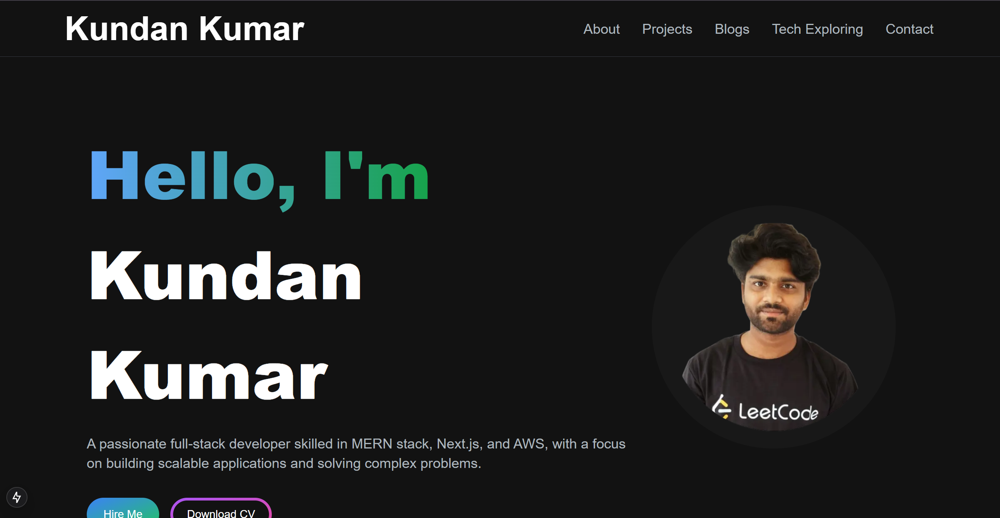

# Kundan Kumar - Full Stack Developer Portfolio 🚀

A modern, responsive, and interactive digital portfolio showcasing my skills, experience, education, and projects. Built with cutting-edge technologies for an exceptional user experience.



## ✨ About Me

I'm a **Full Stack Developer** currently pursuing **Computer Science & Engineering** at **National Institute of Technology, Agartala** (2021-2025). Passionate about creating innovative web applications and solving complex problems through technology.

---

## 🎯 Features

- **🎨 Modern Design**: Clean, professional UI with smooth animations and transitions
- **📱 Fully Responsive**: Optimized for all devices - desktop, tablet, and mobile
- **⚡ Performance Optimized**: Fast loading times with Next.js and optimized assets
- **🌙 Dark Mode**: Beautiful dark theme with smooth transitions
- **📧 Contact Integration**: Working contact form with email functionality
- **🎭 Advanced Animations**: Framer Motion powered animations throughout
- **🔍 Project Filtering**: Dynamic project showcase with category filtering
- **📊 Interactive Timeline**: Visual representation of education and experience
- **🎯 SEO Optimized**: Built with best practices for search engine optimization

---

## 🛠️ Tech Stack

### **Frontend**
- **Next.js 14** (App Router) - React framework
- **Tailwind CSS** - Utility-first CSS framework
- **Framer Motion** - Animation library
- **Aceternity UI** - Modern UI components
- **shadcn/ui** - Re-usable components

### **Backend & APIs**
- **Next.js API Routes** - Server-side functionality
- **Nodemailer** - Email integration
- **MongoDB** - Database (for future features)

### **Deployment & Tools**
- **Vercel** - Hosting platform
- **Docker** - Containerization
- **Git** - Version control

---

## 🚀 Live Demo

**[View Live Portfolio](https://kundan-cv-portfolio.vercel.app/)**

---

## 🏃‍♂️ Quick Start

### Prerequisites
- Node.js (v18 or higher)
- npm/yarn/pnpm/bun

### Installation

1. **Clone the repository**
   ```bash
   git clone https://github.com/its-kundan/Kundan_CV_Portfolio.git
   cd Kundan_CV_Portfolio
   ```

2. **Install dependencies**
   ```bash
   npm install
   # or
   yarn install
   # or
   pnpm install
   ```

3. **Run development server**
   ```bash
   npm run dev
   # or
   yarn dev
   ```

4. **Open your browser**
   Navigate to [http://localhost:3000](http://localhost:3000)

---

## 🐳 Docker Support

### Development with Docker
```bash
# Build and run with hot reload
docker-compose -f docker-compose.dev.yml up --build

# Run in background
docker-compose -f docker-compose.dev.yml up -d --build
```

### Production with Docker
```bash
# Build and run production
docker-compose up --build

# Run in background
docker-compose up -d --build
```

### Manual Docker Commands
```bash
# Development
docker build -f Dockerfile.dev -t portfolio-dev .
docker run -p 3000:3000 -v $(pwd):/app portfolio-dev

# Production
docker build -t portfolio .
docker run -p 3000:3000 portfolio
```

**Docker Benefits:**
- ✅ Consistent development environment
- ✅ No local Node.js installation required
- ✅ Isolated dependencies
- ✅ Easy deployment
- ✅ Version-controlled environment

---

## 📁 Project Structure

```
Kundan_CV_Portfolio/
├── 📁 public/                 # Static assets
│   ├── 📁 images/            # Images and media files
│   ├── 📁 assets/            # Additional assets
│   └── *.js                  # Data files
├── 📁 src/
│   ├── 📁 app/               # Next.js app router
│   │   ├── 📁 api/           # API routes
│   │   ├── 📁 components/    # Page components
│   │   └── *.js              # Page files
│   ├── 📁 components/        # Reusable components
│   │   ├── 📁 ui/            # UI components
│   │   └── *.jsx             # Component files
│   └── 📁 lib/               # Utilities and helpers
├── 📄 Dockerfile             # Production Docker config
├── 📄 Dockerfile.dev         # Development Docker config
├── 📄 docker-compose.yml     # Docker compose config
└── 📄 package.json           # Dependencies and scripts
```

---

## 🎨 Customization Guide

### **Personal Information**
- Update content in `src/components/` files
- Modify `public/*.js` data files for projects, skills, etc.
- Edit `src/app/page.js` for main page content

### **Styling**
- Customize colors in `tailwind.config.js`
- Modify global styles in `src/app/globals.css`
- Update component-specific styles

### **Adding Projects**
- Edit `public/projects/data.js` or `public/projectdata.js`
- Add project images to `public/images/projects/`
- Update project categories and tags

---

## 🚀 Deployment

### **Vercel (Recommended)**
1. Push code to GitHub
2. Connect repository to [Vercel](https://vercel.com)
3. Deploy automatically

### **Other Platforms**
- **Netlify**: Connect GitHub repository
- **Railway**: Deploy with Docker support
- **AWS/GCP**: Use Docker containers

---

## 📚 Education & Experience

### **Education**
- **Bachelor of Technology in Computer Science & Engineering**
  - National Institute of Technology, Agartala
  - **2021 - 2025** (Current)
  - Focus: Full Stack Development, Machine Learning, IoT

### **Experience**
- **SDET Intern** at Stashfin (June 2025 - August 2025)
- **Software Development Intern** at Onlinejaoo.com (Jan 2024 - Jun 2024)
- **Full-Stack Developer** (Freelance, Jun 2022 - Present)

---

## 🛠️ Development

### **Available Scripts**
```bash
npm run dev          # Start development server
npm run build        # Build for production
npm run start        # Start production server
npm run lint         # Run ESLint
```

### **Environment Variables**
Create `.env.local` for local development:
```env
# Email Configuration
EMAIL_USER=your-email@gmail.com
EMAIL_PASS=your-app-password
```

---

## 🤝 Contributing

Contributions are welcome! Please feel free to submit a Pull Request.

### **How to Contribute**
1. Fork the repository
2. Create a feature branch (`git checkout -b feature/AmazingFeature`)
3. Commit your changes (`git commit -m 'Add some AmazingFeature'`)
4. Push to the branch (`git push origin feature/AmazingFeature`)
5. Open a Pull Request

---

## 📄 License

This project is licensed under the **MIT License** - see the [LICENSE](LICENSE) file for details.

---

## 🙏 Acknowledgments

- **Vercel** for amazing hosting platform
- **Next.js** team for the incredible framework
- **Tailwind CSS** for the utility-first approach
- **Framer Motion** for smooth animations
- **Aceternity UI** for beautiful components
- **shadcn/ui** for re-usable component library

---

## 📞 Contact

- **Email**: [your-email@example.com](mailto:your-email@example.com)
- **LinkedIn**: [Your LinkedIn](https://linkedin.com/in/your-profile)
- **GitHub**: [@its-kundan](https://github.com/its-kundan)
- **Portfolio**: [Live Website](https://your-portfolio-link.com)

---

**⭐ Star this repository if you found it helpful!**

---

*Built with ❤️ by Kundan Kumar*
